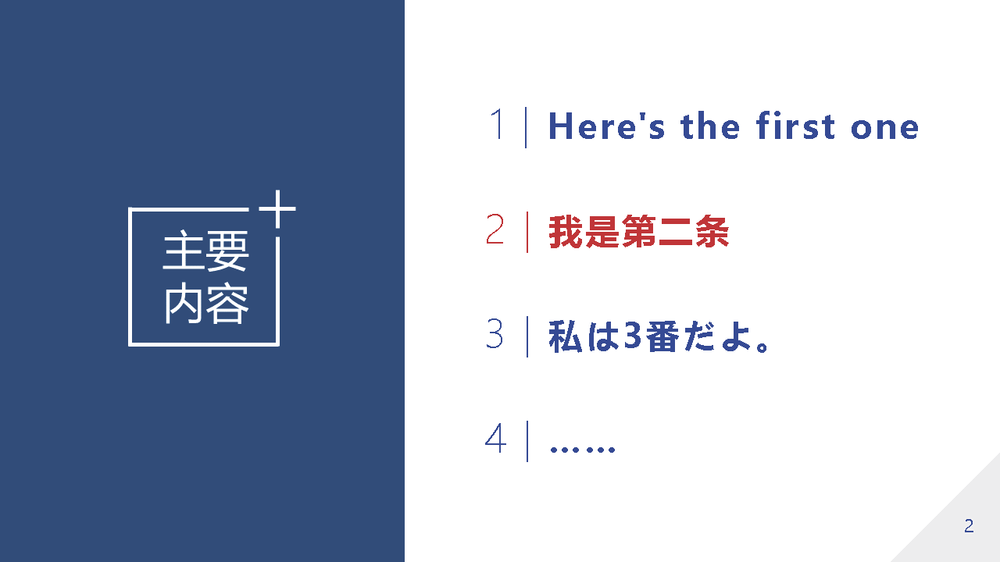
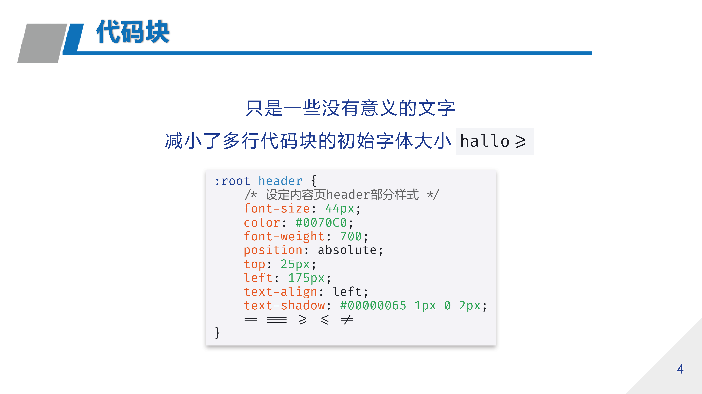
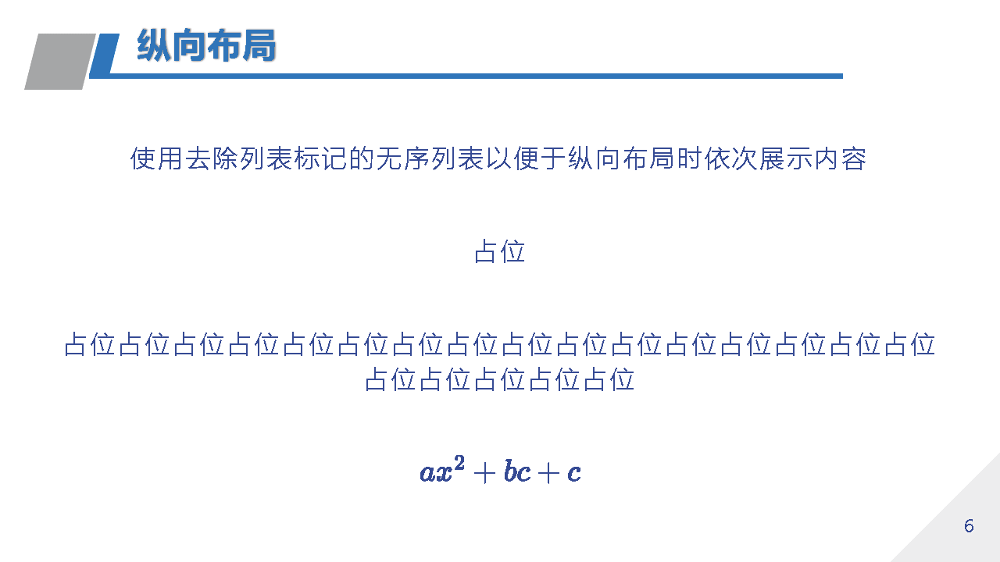

# Nouchi DUT_1

> 一款基于 Marp 官方主题 [uncover](https://github.com/marp-team/marp-core/blob/main/themes/uncover.scss) 的 [Marp](https://marp.app/) 主题

Nouchi DUT_1 是一款基于 uncover，适用于大连理工大学的一款 Marp 主题，之所以有个`_1`是因为**可能**还会有`_2` `_3`……

## 主要样式

-   **表格** 修改了原有表格样式，使用三线表作为默认表格样式
-   **目录页** 添加了目录页，使用 `<!-- _class: catalogs -->` 标识，并支持使用 `**文字**` 标识突出特定列表项

</img>

-   **代码块** 减小了多行代码块默认字体大小，以减小默认空间占用，替换了代码块字体为更易于展示代码的字体 [Fira Code](https://github.com/tonsky/FiraCode)

</img>

-   **横向** 添加了横向布局，使用 `<!-- _class: row -->` 标识，便于横向展示图片等内容

> 图中用于演示的画作均来自画师 [雨铃](https://www.pixiv.net/users/46694245)，**有裁剪**，侵权可联系删除及赔偿 *非常好画师，爱来自小鹿包，大家快去关注*

</img>

-   **纵向** 添加了纵向布局，使用 `<!-- _class: column -->` 标识，便于使用 **HTML** 演示时逐项展示内容

</img>

-   更多细节可自行阅读 [Nouchi_DUT_1](./theme/Nouchi_DUT_1.css)

## 使用

> 使用前请先了解 [Markdown](https://markdown.com.cn/basic-syntax/) 以及 [Marp](https://caizhiyuan.gitee.io/categories/skills/20200730-marp.html) 基本语法

> 推荐复制 [test.md](./test.md) 以修改使用

在 vscode 中安装插件 [Marp for VS Code
](https://marketplace.visualstudio.com/items?itemName=marp-team.marp-vscode&ssr=false#overview)

将整个项目下载或 clone 到本地,使用 vscode 打开项目，在根目录中新建 .md 文件，在头部原信息中声明 `theme: Nouchi_DUT_1` 即可

img 文件夹其中的 [leadBg1.png](./img/leadBg1.png) 为首页背景，可自行替换以适用于其他学校或场合

## 鸣谢

[@williowon](https://github.com/williowon)

[@雨铃](https://www.pixiv.net/users/46694245)

[Fira Code](https://github.com/tonsky/FiraCode)

